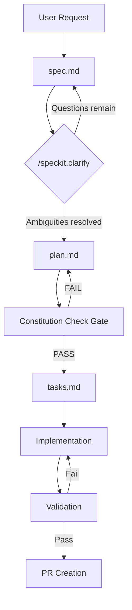

```mermaid
graph TD
    A["User Request"] --> B["spec.md"]
    B --> C{"/speckit.clarify"}
    C -->|Ambiguities resolved| D["plan.md"]
    C -->|Questions remain| B
    D --> E["Constitution Check Gate"]
    E -->|PASS| F["tasks.md"]
    E -->|FAIL| D
    F --> G["Implementation"]
    G --> H["Validation"]
    H -->|Pass| I["PR Creation"]
    H -->|Fail| G
```
