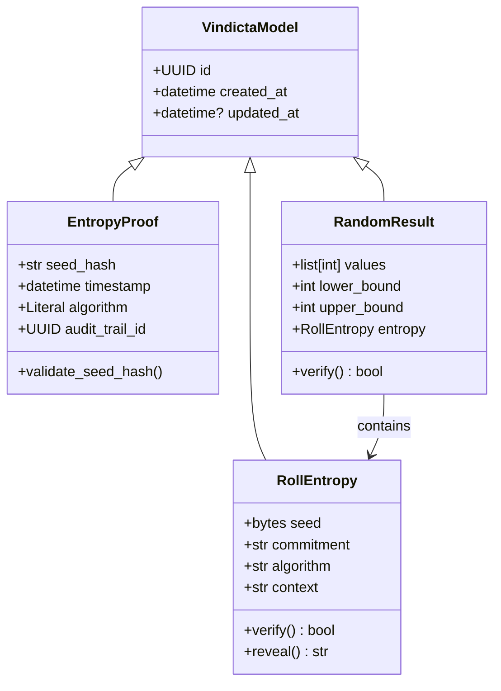

# Data Model: dice-core

**Feature**: Dice Core — CSPRNG with Verifiable Entropy Proofs  
**Date**: 2026-02-22  
**Base Class**: `VindictaModel` from `src/vindicta_foundation/models/base.py`

---

## Entity Overview

---

## Entities

### 1. RollEntropy (NEW)

**Source**: spec.md Key Entity "RollEntropy"  
**Purpose**: Encapsulates the seed material, HMAC commitment, and verification logic for a single roll event.  
**Inherits from**: `VindictaModel`

| Field        | Type       | Required | Default         | Description                                           |
| ------------ | ---------- | -------- | --------------- | ----------------------------------------------------- |
| `id`         | `UUID`     | ✓        | `uuid4()`       | Inherited from VindictaModel                          |
| `created_at` | `datetime` | ✓        | `now(utc)`      | Inherited from VindictaModel                          |
| `seed`       | `bytes`    | ✓        | —               | Raw 32-byte CSPRNG seed (kept private until reveal)   |
| `commitment` | `str`      | ✓        | —               | HMAC-SHA256 hex digest of the seed + context          |
| `algorithm`  | `str`      | ✓        | `"hmac-sha256"` | Algorithm used for the commitment                     |
| `context`    | `str`      | ✓        | `""`            | Contextual binding string (e.g. game ID, turn number) |

**Validation Rules**:
- `seed` must be exactly 32 bytes
- `commitment` must be a valid 64-character hex string
- `algorithm` must be one of: `"hmac-sha256"`

**Methods**:
- `verify(revealed_seed: bytes) -> bool`: Recompute HMAC from the revealed seed and compare against commitment
- `reveal() -> str`: Return the hex-encoded seed for external auditing

**Relationship to existing `EntropyProof`**: `EntropyProof` is the existing foundation model for audit trail linkage. `RollEntropy` is a more specific, operational model that carries the actual seed material and verification logic for a single roll. They serve different layers: `EntropyProof` is an audit record; `RollEntropy` is a live cryptographic artifact.

---

### 2. RandomResult (NEW)

**Source**: spec.md Key Entity "RandomResult"  
**Purpose**: Contains the generated random integers along with the cryptographic proof binding.  
**Inherits from**: `VindictaModel`

| Field         | Type          | Required | Default    | Description                                     |
| ------------- | ------------- | -------- | ---------- | ----------------------------------------------- |
| `id`          | `UUID`        | ✓        | `uuid4()`  | Inherited from VindictaModel                    |
| `created_at`  | `datetime`    | ✓        | `now(utc)` | Inherited from VindictaModel                    |
| `values`      | `list[int]`   | ✓        | —          | The generated random integers                   |
| `lower_bound` | `int`         | ✓        | —          | Minimum value (inclusive) of the roll range     |
| `upper_bound` | `int`         | ✓        | —          | Maximum value (inclusive) of the roll range     |
| `entropy`     | `RollEntropy` | ✓        | —          | The cryptographic proof binding for this result |

**Validation Rules**:
- `values` must not be empty
- All values must satisfy `lower_bound <= value <= upper_bound`
- `lower_bound` must be < `upper_bound`
- `lower_bound` must be >= 1 (dice faces are positive integers)

**Methods**:
- `verify() -> bool`: Delegates to `self.entropy.verify()` for proof validation

---

## Enum: RngMode

**Purpose**: Runtime mode selector for CSPRNG vs deterministic test engine.

| Value        | Description                                                                 |
| ------------ | --------------------------------------------------------------------------- |
| `PRODUCTION` | Uses `secrets` module CSPRNG — deterministic seeding raises `SecurityError` |
| `TESTING`    | Allows deterministic seeding via `random.Random(seed)` for reproducible CI  |

---

## Service: DiceEngine (Protocol/Interface)

**Purpose**: Defines the contract for random number generation with proofs.  
**Not a model** — this is a service-layer protocol.

| Method | Signature                                                            | Returns        | Description                                                             |
| ------ | -------------------------------------------------------------------- | -------------- | ----------------------------------------------------------------------- |
| `roll` | `(lower: int, upper: int, count: int, context: str) -> RandomResult` | `RandomResult` | Generate `count` random integers in `[lower, upper]` with entropy proof |

---

## Mapping to Spec Requirements

| Requirement                     | Entity/Field             | Notes                                    |
| ------------------------------- | ------------------------ | ---------------------------------------- |
| FR-001 (CSPRNG)                 | `DiceEngine` impl        | Uses `secrets.randbelow()`               |
| FR-002 (Proof)                  | `RollEntropy.commitment` | HMAC-SHA256 commitment scheme            |
| FR-003 (No predictable sources) | `DiceEngine` impl        | `secrets` module only in production mode |
| FR-004 (Deterministic testing)  | `RngMode.TESTING`        | Gated `random.Random(seed)` adapter      |
| FR-005 (Pure Python API)        | All entities             | stdlib only, no external services        |
| AX-03 (Probability Source)      | `RandomResult`           | Fair N-faced die via `randbelow(N)`      |
