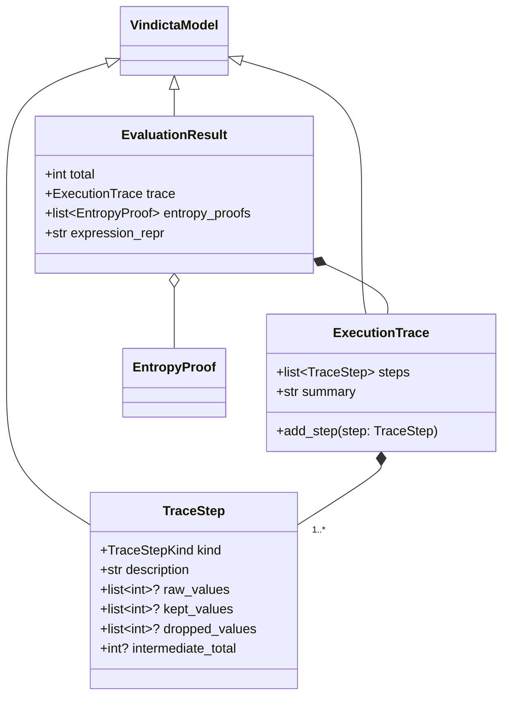

# Data Model: dice-evaluator

**Feature**: dice-evaluator | **Date**: 2026-02-22

## Entity Relationship



## Entities

### TraceStep

**File**: `src/vindicta_foundation/models/evaluation.py`
**Inherits**: `VindictaModel`

| Field                | Type                      | Required | Description                                                           |
| -------------------- | ------------------------- | -------- | --------------------------------------------------------------------- |
| `kind`               | `TraceStepKind` (Literal) | Yes      | Type of operation: `"roll"`, `"modifier"`, `"arithmetic"`, `"result"` |
| `description`        | `str`                     | Yes      | Human-readable description, e.g., `"Rolled 2d6 → [3, 5]"`             |
| `raw_values`         | `list[int] \| None`       | No       | Raw dice values before modifiers                                      |
| `kept_values`        | `list[int] \| None`       | No       | Values kept after modifier application                                |
| `dropped_values`     | `list[int] \| None`       | No       | Values dropped by modifier                                            |
| `intermediate_total` | `int \| None`             | No       | Running total after this step                                         |

**Validation**:
- `kind` must be one of the defined `TraceStepKind` literals
- `raw_values`, if present, must be non-empty with all values ≥ 1

---

### ExecutionTrace

**File**: `src/vindicta_foundation/models/evaluation.py`
**Inherits**: `VindictaModel`

| Field     | Type              | Required           | Description                                       |
| --------- | ----------------- | ------------------ | ------------------------------------------------- |
| `steps`   | `list[TraceStep]` | Yes (default `[]`) | Ordered list of evaluation steps                  |
| `summary` | `str`             | Yes (default `""`) | Human-readable summary, e.g., `"[3, 5] + 3 = 11"` |

**Methods**:
- `add_step(step: TraceStep) -> None`: Appends a step to the trace

---

### EvaluationResult

**File**: `src/vindicta_foundation/models/evaluation.py`
**Inherits**: `VindictaModel`

| Field             | Type                 | Required           | Description                                          |
| ----------------- | -------------------- | ------------------ | ---------------------------------------------------- |
| `total`           | `int`                | Yes                | Final computed integer result                        |
| `trace`           | `ExecutionTrace`     | Yes                | Step-by-step evaluation audit trail                  |
| `entropy_proofs`  | `list[EntropyProof]` | Yes (default `[]`) | Cryptographic proofs from `dice-core` for every roll |
| `expression_repr` | `str`                | Yes (default `""`) | String representation of the original expression     |

**Validation**:
- `entropy_proofs` length must match the number of `"roll"` steps in `trace`

## Protocols (Non-persisted)

### DiceRoller (Protocol)

**File**: `src/vindicta_foundation/evaluator/protocols.py`

```python
class DiceRoller(Protocol):
    def roll(self, sides: int, count: int = 1) -> RollResult: ...
```

| Method | Input                    | Output                                | Description                                      |
| ------ | ------------------------ | ------------------------------------- | ------------------------------------------------ |
| `roll` | `sides: int, count: int` | `RollResult` (values + entropy proof) | Generate `count` random integers in `[1, sides]` |

### RollResult (NamedTuple or small model)

| Field    | Type           | Description                    |
| -------- | -------------- | ------------------------------ |
| `values` | `list[int]`    | The generated random integers  |
| `proof`  | `EntropyProof` | Associated cryptographic proof |

## Error Types

### EvaluationError hierarchy

**File**: `src/vindicta_foundation/evaluator/errors.py`

| Error Class            | Parent            | When Raised                                                    |
| ---------------------- | ----------------- | -------------------------------------------------------------- |
| `EvaluationError`      | `Exception`       | Base class for all evaluator errors                            |
| `InvalidASTError`      | `EvaluationError` | Malformed or null AST node encountered                         |
| `DivisionByZeroError`  | `EvaluationError` | Division operation with zero divisor                           |
| `UnsupportedNodeError` | `EvaluationError` | Unknown AST node type encountered                              |
| `ModifierError`        | `EvaluationError` | Invalid modifier parameters (e.g., keep more dice than rolled) |
