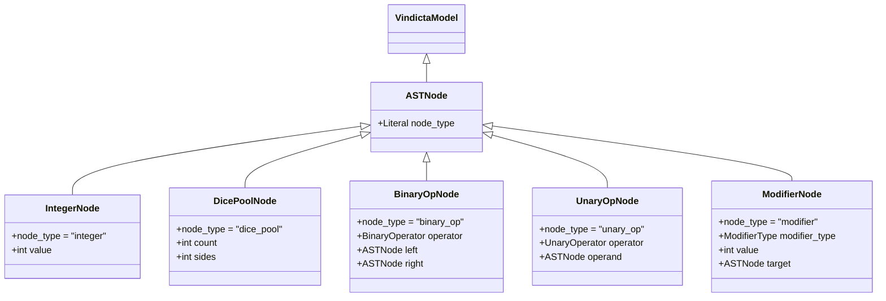

# Data Model: dice-parser

**Feature**: dice-parser | **Date**: 2026-02-22

## Entity Overview

All AST node models inherit from `VindictaModel` (Constitution §II). The discriminated union uses a `node_type` literal field for downstream pattern matching and JSON round-tripping.



## Entities

### ASTNode (Abstract Base)

The `ASTNode` concept is represented by the Pydantic discriminated union `ASTNodeType`. There is no separate `ASTNode` base class beyond `VindictaModel`; discrimination happens at the type-union level.

---

### IntegerNode

**Purpose**: Represents a literal integer constant in the expression.

| Field       | Type                 | Constraints   | Description       |
| ----------- | -------------------- | ------------- | ----------------- |
| `node_type` | `Literal["integer"]` | Discriminator | Node type tag     |
| `value`     | `int`                | Required      | The integer value |

**Validation**: `value` must be a valid integer (Pydantic handles this).

---

### DicePoolNode

**Purpose**: Represents `NdS` — N dice with S sides. Maps directly to AX-03 (Probability Source).

| Field       | Type                   | Constraints   | Description             |
| ----------- | ---------------------- | ------------- | ----------------------- |
| `node_type` | `Literal["dice_pool"]` | Discriminator | Node type tag           |
| `count`     | `int`                  | `≥ 1`         | Number of dice to roll  |
| `sides`     | `int`                  | `≥ 1`         | Number of faces per die |

**Validation**:
- `count >= 1`: Cannot roll zero or negative dice.
- `sides >= 1`: A die must have at least 1 face.

---

### BinaryOpNode

**Purpose**: Represents a binary arithmetic operation (`+`, `-`, `*`, `/`).

| Field       | Type                   | Constraints                      | Description   |
| ----------- | ---------------------- | -------------------------------- | ------------- |
| `node_type` | `Literal["binary_op"]` | Discriminator                    | Node type tag |
| `operator`  | `BinaryOperator`       | Enum: `add`, `sub`, `mul`, `div` | The operation |
| `left`      | `ASTNodeType`          | Required                         | Left operand  |
| `right`     | `ASTNodeType`          | Required                         | Right operand |

**Validation**: `operator` must be one of the defined enum values.

---

### UnaryOpNode

**Purpose**: Represents a unary operation (e.g., negation `-3`).

| Field       | Type                  | Constraints   | Description         |
| ----------- | --------------------- | ------------- | ------------------- |
| `node_type` | `Literal["unary_op"]` | Discriminator | Node type tag       |
| `operator`  | `UnaryOperator`       | Enum: `neg`   | The unary operation |
| `operand`   | `ASTNodeType`         | Required      | Operand             |

---

### ModifierNode

**Purpose**: Represents a modifier applied to a dice pool result.

| Field           | Type                  | Constraints                                                                   | Description                                        |
| --------------- | --------------------- | ----------------------------------------------------------------------------- | -------------------------------------------------- |
| `node_type`     | `Literal["modifier"]` | Discriminator                                                                 | Node type tag                                      |
| `modifier_type` | `ModifierType`        | Enum: `keep_highest`, `keep_lowest`, `drop_highest`, `drop_lowest`, `explode` | Which modifier                                     |
| `value`         | `int`                 | `≥ 1` for keep/drop; equals die `sides` default for explode                   | Modifier parameter                                 |
| `target`        | `ASTNodeType`         | Required                                                                      | The node being modified (typically `DicePoolNode`) |

**Validation**:
- `value >= 1`: Must keep/drop/explode at least 1.
- `target` is typically a `DicePoolNode` but the grammar allows nesting.

## Supporting Enums

### BinaryOperator

```python
class BinaryOperator(str, Enum):
    ADD = "add"
    SUB = "sub"
    MUL = "mul"
    DIV = "div"
```

### UnaryOperator

```python
class UnaryOperator(str, Enum):
    NEG = "neg"
```

### ModifierType

```python
class ModifierType(str, Enum):
    KEEP_HIGHEST = "keep_highest"
    KEEP_LOWEST = "keep_lowest"
    DROP_HIGHEST = "drop_highest"
    DROP_LOWEST = "drop_lowest"
    EXPLODE = "explode"
    REROLL = "reroll"
```

## Discriminated Union

```python
ASTNodeType = Annotated[
    IntegerNode | DicePoolNode | BinaryOpNode | UnaryOpNode | ModifierNode,
    Field(discriminator="node_type"),
]
```

## Serialization (SC-004)

All nodes serialize cleanly via `model_dump()` / `model_dump_json()` and deserialize via `model_validate()` / `model_validate_json()`. The discriminator field (`node_type`) ensures round-trip fidelity for nested trees.

Example JSON for `"2d6 + 3"`:

```json
{
  "node_type": "binary_op",
  "operator": "add",
  "left": {
    "node_type": "dice_pool",
    "count": 2,
    "sides": 6
  },
  "right": {
    "node_type": "integer",
    "value": 3
  }
}
```
