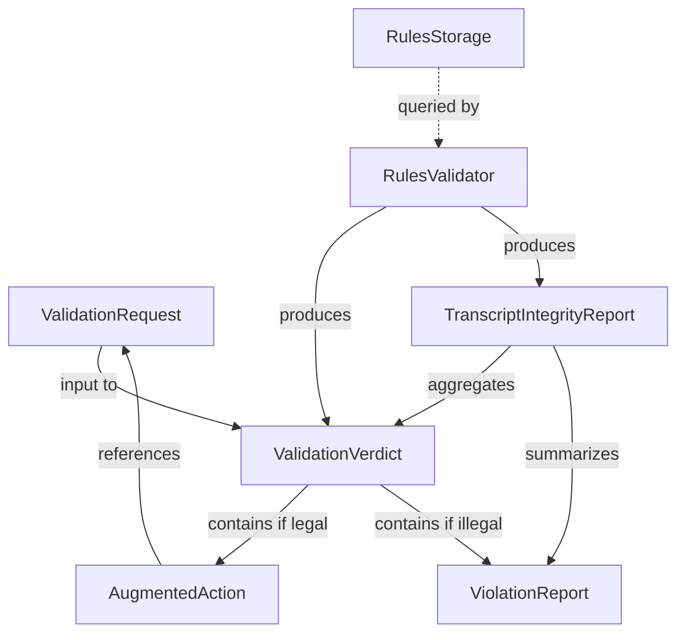

# Data Model: Rules Validation Parser

**Feature Branch**: `006-rules-validation-parser`
**Date**: 2026-02-23

## Entities

All entities inherit from `VindictaModel` (`src/vindicta_foundation/models/base.py`), which provides `id` (UUID), `created_at`, and `updated_at` fields.

### ViolationType (StrEnum)

Defines the taxonomy of validation failures. Located in `src/vindicta_foundation/validation/types.py`.

```python
class ViolationType(StrEnum):
    WEAPON_NOT_FOUND = "weapon_not_found"
    ABILITY_NOT_FOUND = "ability_not_found"
    ILLEGAL_ACTION = "illegal_action"
    RULES_NOT_FOUND = "rules_not_found"
    LOADOUT_AMBIGUOUS = "loadout_ambiguous"
    VERSION_MISMATCH = "version_mismatch"
```

### VerdictStatus (StrEnum)

```python
class VerdictStatus(StrEnum):
    LEGAL = "legal"
    ILLEGAL = "illegal"
    HALLUCINATION = "hallucination"
    ERROR = "error"  # RAG unavailable (FR-007)
```

### ValidationRequest (VindictaModel)

Pre-parsed game action object from upstream parser. Located in `src/vindicta_foundation/models/validation.py`.

| Field | Type | Required | Description |
|-------|------|----------|-------------|
| `unit_id` | `str` | Yes | WARScribe unit identifier (e.g., `TAC-01`) |
| `action_type` | `str` | Yes | Action category (e.g., `SHOOT`, `CHARGE`, `ABILITY`) |
| `target` | `str \| None` | No | Target identifier (e.g., `Enemy-01`) |
| `weapon` | `str \| None` | No | Weapon name (if action involves a weapon) |
| `ability` | `str \| None` | No | Ability name (if action involves an ability) |

### ViolationReport (VindictaModel)

Structured violation details for a failed validation.

| Field | Type | Required | Description |
|-------|------|----------|-------------|
| `violation_type` | `ViolationType` | Yes | Category of the violation |
| `offending_element` | `str` | Yes | The element that caused the violation (weapon name, ability name, etc.) |
| `expected_values` | `list[str]` | Yes | What the rules database says should be available |
| `rules_text` | `str \| None` | No | Corrective rules text (if available) |
| `source_url` | `str \| None` | No | URL of the rules source |
| `rules_version` | `int \| None` | No | Version of the rules consulted |

### AugmentedAction (VindictaModel)

A validated legal action enriched with rules text.

| Field | Type | Required | Description |
|-------|------|----------|-------------|
| `request` | `ValidationRequest` | Yes | The original validation request |
| `rules_text` | `str` | Yes | Full rules text (weapon profile, ability description) |
| `source_url` | `str` | Yes | URL origin of the rules |
| `rules_version` | `int` | Yes | Version identifier of the matched rules |

### ValidationVerdict (VindictaModel)

Result of a single action validation.

| Field | Type | Required | Description |
|-------|------|----------|-------------|
| `request` | `ValidationRequest` | Yes | The original request being validated |
| `status` | `VerdictStatus` | Yes | Verdict: legal, illegal, hallucination, or error |
| `augmented_action` | `AugmentedAction \| None` | No | Present only when status is `legal` |
| `violation` | `ViolationReport \| None` | No | Present only when status is `illegal` or `hallucination` |
| `error_message` | `str \| None` | No | Present only when status is `error` (FR-007) |

### TranscriptIntegrityReport (VindictaModel)

Aggregate report for batch validation.

| Field | Type | Required | Description |
|-------|------|----------|-------------|
| `verdicts` | `list[ValidationVerdict]` | Yes | Per-action verdicts |
| `total_actions` | `int` | Yes | Total number of actions validated |
| `legal_count` | `int` | Yes | Count of legal actions |
| `illegal_count` | `int` | Yes | Count of illegal/hallucination actions |
| `error_count` | `int` | Yes | Count of error verdicts |
| `integrity_pct` | `float` | Yes | `(legal_count / total_actions) * 100` |
| `violations_summary` | `list[ViolationReport]` | Yes | Flattened list of all violations |

## Relationships



## Validation Rules

- `ValidationVerdict.augmented_action` MUST be `None` when `status` is not `LEGAL`.
- `ValidationVerdict.violation` MUST be `None` when `status` is `LEGAL`.
- `TranscriptIntegrityReport.integrity_pct` MUST equal `(legal_count / total_actions) * 100`.
- `ViolationReport.expected_values` MUST NOT be empty (always provide context for what was expected).
